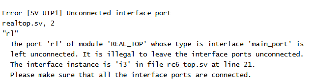

# MY NOTE

## note DEC 14/2018
+ always@(posedge CLK) is used to describe a D-Flip Flop, while @(posedge CLK); is used in testbench.

+ % m means the curent scope.

## note DEC 14/2018
+ Use pipeline to interrupt the timng delay.

+ What can I do to connect the different name between interface modport and module? Maybe to use a midvariable to translate the signal.

+ .r1(pinsl_if.r) .clk(clk_if.clk) can connect thoes wires. 
